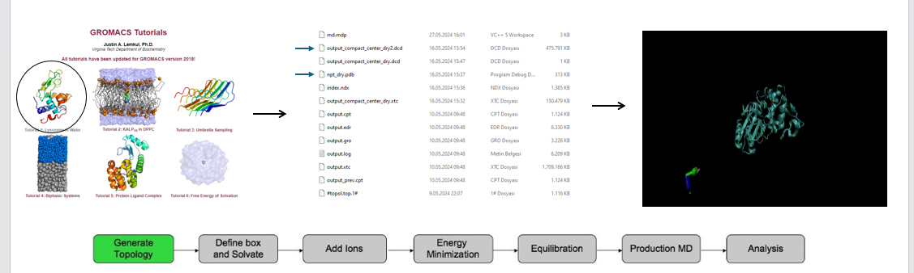

# Investigation of relationships between sequence, structure, and dynamics of a soluble globular protein

In this project, the molecular dynamics of a globular protein was simulated and the results obtained were analyzed. The aim here is to understand how the sequence, structure and dynamics of a protein are related to each other. The protein was simulated with a 50-nanometer molecular dynamics simulation solved in explicit solvent and using the **GROMACS** force field. Then, trajectory analysis was performed with the obtained results.
## Protein Informations

**Protein name:** TEM-1 β lactamase
**Function:** Hydrolyzes to β-Lactam and inactivates to Resistance to β-lactam antibiotics
**PDB ID:** 3DTM
Molecular Dynamics Simulation Process

To analyze your trajectory, calculate:

• The root mean square deviation, or RMSD, of the C-alpha atoms from the starting structure. This looks at whether the protein has changed shape over time.

• The root mean square fluctuation, or RMSF, of the C-alpha atoms. This looks at the flexible and rigid parts of the protein.

• Cross-correlations between the movements of different parts. This looks for parts that move together.

• Fundamental dynamics, to find the collective movements that underlie the most movement. This looks at whether any significant functional movements emerge.

## Terminology Definition
**RMSD**: Root Mean Square Deviation is a standard measure of structural distance between coordinates and measures the average distance between protein atoms.

**RMSF**: Root Mean Square Fluctuation measures the average deviation of a protein residue from a reference position over time.

**EDA**: Essential Dynamics Analysis is an analysis method used to examine the movement modes of proteins in MD simulations

**NMA**: Normal mode analysis (NMA) is a technique that can be used to learn the flexible states a protein can have around its equilibrium position.
